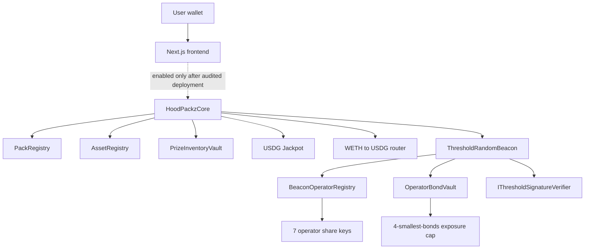
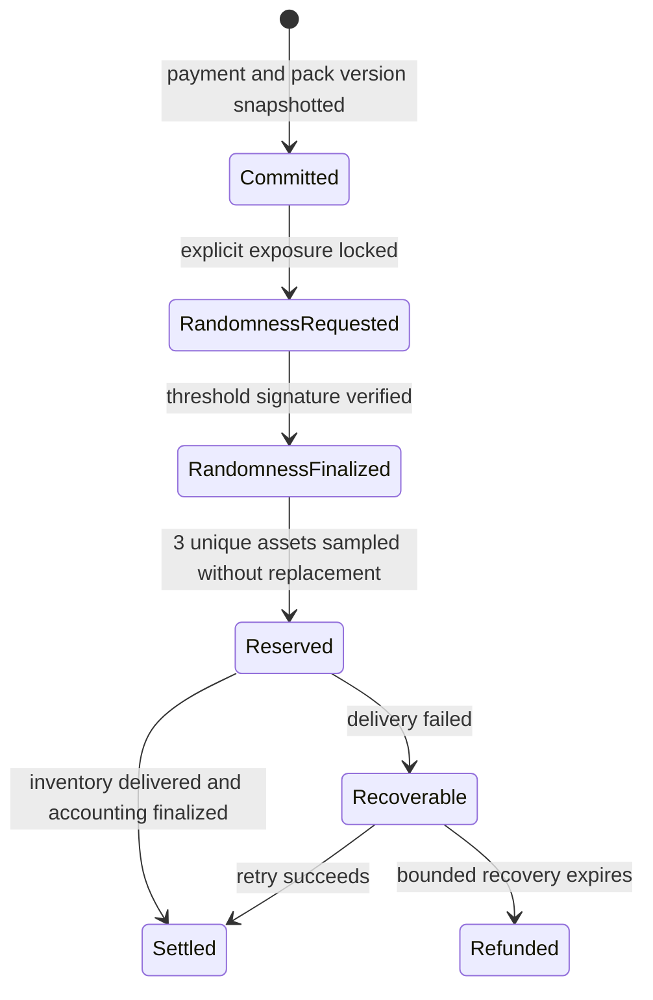

# HoodPackz V2 Architecture

HoodPackz V2 separates pack settlement from bonded randomness. The randomness subsystem is implemented; the pack and asset subsystems remain design targets and are not deployed.

## System map

Solid boxes in the randomness branch exist in the repository. Pack settlement boxes are planned V2 modules.

## Randomness lifecycle

1. The consumer requests randomness with explicit economic exposure.
2. The registry resolves the active append-only key epoch.
3. Four operator bonds are locked to cover the request exposure.
4. The round is sealed, starting signing and rescue deadlines.
5. The normal path verifies one aggregate threshold signature.
6. The rescue path verifies attributable shares and identifies missing operators.
7. Signature-derived randomness becomes immutable.
8. Consumer delivery executes separately and can be retried without changing randomness.
9. Bonds unlock or are slashed according to the finalized round outcome.

## Randomness invariants

1. Explicit zero exposure and the legacy one-argument request API fail closed.
2. Exposure cannot exceed the sum of the four smallest available operator bonds.
3. Pending withdrawals do not count as available collateral.
4. Signing deadlines begin at sealing, not at request creation.
5. Master and share keys are validated by the same verifier used by the beacon.
6. The beacon rejects a registry configured with a different verifier.
7. Final randomness cannot change because callback delivery failed.

## Planned pack lifecycle

The implementation must snapshot pack version, admitted assets, weights, economics, jackpot parameters, and delivery bounds before randomness is known.

## Economic model

Each pack tier is denominated in USDG:

| Tier | Price | Prize EV | Jackpot | Protocol |
| --- | ---: | ---: | ---: | ---: |
| Corner | 5 | 4 | 0.5 | 0.5 |
| Block | 15 | 12 | 1.5 | 1.5 |
| City | 50 | 40 | 5 | 5 |

The jackpot must be funded and exposure-capped. Fixed operator bonds cannot secure an uncapped jackpot.

## Asset admission

The planned registry is versioned and fail-closed. Assets require code-hash and ownership review, transfer-behavior tests, liquidity bounds, decimals validation, and emergency disable controls. Fee-on-transfer, rebasing, blacklistable, owner-mintable, and unsafe proxy assets are excluded.

## Frontend boundary

The frontend exposes wallet connection, network switching, pack previews, economics, and protocol status. Without a configured HoodPackz V2 core address and ABI, its purchase control remains disabled and `/api/packs/open` returns `V2_NOT_DEPLOYED`.

## Legacy boundary

Original StockPackz contracts and stock-oriented modules remain in the repository for attribution and migration analysis. They are not dependencies of the HoodPackz V2 root application and must not be presented as the V2 mainnet path.
