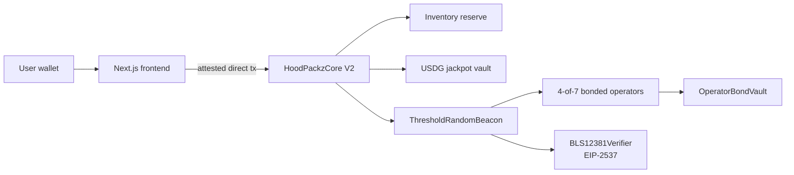

# HoodPackz

**On-chain meme token packs. Three tokens per pull. Real randomness with slashable collateral.**

[](https://hoodpackz.fun)
[](https://robinhoodchain.blockscout.com)
[](https://github.com/Jaredweb3here/hoodpackz/actions/workflows/contracts.yml)
[](https://github.com/Jaredweb3here/hoodpackz/actions/workflows/frontend.yml)
[](LICENSE)
[](contracts/)

---

## What is HoodPackz

You pay USDG. You get three real ERC-20 meme tokens from a seven-asset pool. Which three is determined by a threshold BLS beacon — four independent operator signatures, each backed by slashable collateral. The randomness is onchain, the operators can be slashed if they cheat, and every dollar is accounted for in a published split.

**[→ Open a pack at hoodpackz.fun](https://hoodpackz.fun)**

---

## Pack tiers

| Tier | Price | You get |
|------|-------|---------|
| Corner | 5 USDG | 3 tokens from the pool |
| Block | 15 USDG | 3 tokens from the pool |
| City | 50 USDG | 3 tokens from the pool |

Higher tier = more tokens per slot. Same seven-asset pool, same randomness.

---

## Deployed contracts — Robinhood Chain (4663)

| Contract | Address | Explorer |
|----------|---------|---------|
| **HoodPackzCore V2** | `0x5337Ad84857E433b7d57Ca1130079044Ef37e436` | [view](https://robinhoodchain.blockscout.com/address/0x5337Ad84857E433b7d57Ca1130079044Ef37e436) |
| **ThresholdRandomBeacon** | `0x2B4547eAf629dE637C28146C3104e83f1F0AE7dc` | [view](https://robinhoodchain.blockscout.com/address/0x2B4547eAf629dE637C28146C3104e83f1F0AE7dc) |
| **BLS12381Verifier** | `0xf500CBd6bE6CCa621a0Bca39e384729E51ECF1c8` | [view](https://robinhoodchain.blockscout.com/address/0xf500CBd6bE6CCa621a0Bca39e384729E51ECF1c8) |
| **BeaconOperatorRegistry** | `0xFbE3C11728676604f90ea637450B6FEd24af3bb0` | [view](https://robinhoodchain.blockscout.com/address/0xFbE3C11728676604f90ea637450B6FEd24af3bb0) |
| **OperatorBondVault** | `0x70AFe9e397E0daF274368C6DEbd485F01B7c7E8D` | [view](https://robinhoodchain.blockscout.com/address/0x70AFe9e397E0daF274368C6DEbd485F01B7c7E8D) |
| **USDG** | `0x5fc5360D0400a0Fd4f2af552ADD042D716F1d168` | [view](https://robinhoodchain.blockscout.com/address/0x5fc5360D0400a0Fd4f2af552ADD042D716F1d168) |

---

## Token pool

Seven ERC-20 meme tokens verified on Robinhood Chain mainnet:

| Token | Ticker | Contract |
|-------|--------|---------|
| Cash Cat | CASHCAT | [`0x020b...018b4`](https://robinhoodchain.blockscout.com/token/0x020bfc650a365f8bb26819deaabf3e21291018b4) |
| The Index | INDEX | [`0x5691...9870`](https://robinhoodchain.blockscout.com/token/0x56910d4409f3a0c78c64dd8d0545ff0705389870) |
| The Juggernaut | JUGGERNAUT | [`0xd732...3b88`](https://robinhoodchain.blockscout.com/token/0xd7321801caae694090694ff55a9323139f043b88) |
| Real World Assets | RWA | [`0x4a38...7777`](https://robinhoodchain.blockscout.com/token/0x4a380618777eed8d513bcd6e983df3c5d2ba7777) |
| Pons | PONS | [`0x39db...4571`](https://robinhoodchain.blockscout.com/token/0x39dbed3a2bd333467115de45665cc57f813c4571) |
| Tendies | TENDIES | [`0x4524...cf9`](https://robinhoodchain.blockscout.com/token/0x45242320dbb855eea8fd36804c6487e10e97fcf9) |
| Robinhood Wallet | WALLET | [`0x0339...e1b`](https://robinhoodchain.blockscout.com/token/0x0339f5459fc690ac85f1782e15782a151b4a9e1b) |

---

## Economics

Every pack purchase follows one fixed split, enforced onchain:

```
80%  →  Inventory reserve   (funds the three-token payout)
10%  →  USDG jackpot vault  (1/25,000 odds, 90% of vault paid out)
10%  →  Protocol fee
```

---

## How randomness works

```
1. REQUEST   — pack commits value before any randomness round is sealed
2. SIGN      — 4-of-7 operators produce threshold BLS shares against bonded collateral
3. FINALIZE  — one aggregate BLS signature becomes the immutable random seed
4. DELIVER   — retryable delivery; randomness is final even if delivery is retried
```

The beacon uses EIP-2537 BLS12-381 precompiles (confirmed on chain 4663). Operators can be slashed via `OperatorBondVault` if they behave incorrectly.

---

## Architecture



---

## Repository structure

```
contracts/         Foundry — HoodPackzCore V2, beacon stack, 106 tests
  src/v2/          HoodPackzCore.sol
  src/randomness/  ThresholdRandomBeacon, BLS12381Verifier, registry, vault
  script/          Deploy scripts (beacon + core)
  test/            Full Forge test suite
src/               Next.js 14 frontend
  app/             page.tsx — pack UI
  lib/             chain, tokens, contract interaction
scripts/           DKG ceremony (dkg.mjs), BLS signing (sign-round.mjs)
```

---

## Local development

```bash
npm ci
npm run dev          # http://localhost:3000
```

```bash
cd contracts
forge build
forge test           # 106 passed
```

---

## Security

- Frontend verifies codehash and constructor config hash before every transaction
- Pack sales are fail-closed (`openingsPaused = true` by default)
- No operator private keys or deployer keys on Vercel
- Full Forge suite: unit, integration, fork tests

See [SECURITY.md](SECURITY.md) for threat model and [AUDIT_SCOPE.md](AUDIT_SCOPE.md) for scope.

---

## License

[MIT](LICENSE)
